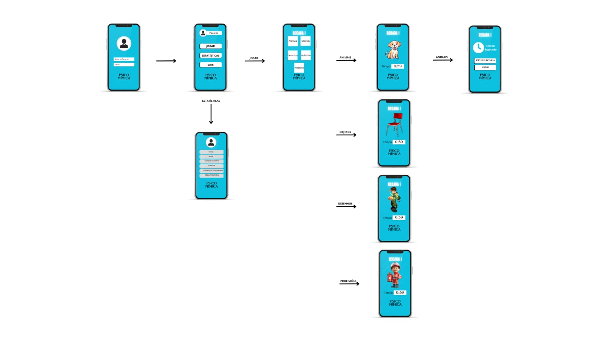

## Projeto de Interface
O fluxograma mostra a interface do usuário e o caminho de navegação de um aplicativo de jogo de mímica. O fluxo começa com uma tela de login e passa por várias opções de menu, como 'Jogar', 'Estatísticas' e 'Sair'. 

- Tela de Login: Primeira tela onde o usuário faz login.

- Menu Principal:
  - Jogar: Leva à tela principal do jogo de mímica.
  - Estatísticas: Abre uma nova tela com informações como nome, idade, partidas jogadas, acertos, perguntas respondidas e perguntas feitas.
  - Sair: Encerra o aplicativo e sai do jogo.

- Jogar > Tela do Jogo de Mímica:
  - Primeira rodada com quatro tipos de ilustrações diferentes para o jogo:
    - Animal: Cachorro
    - Objeto: Cadeira
    - Desenho: Ben 10
    - Profissão: Bombeiro

- Tela de Encerramento da Primeira Rodada:
  - Mostra o tempo que a primeira rodada levou.
  - Opções, para ir para a próxima rodada ou voltar para a tela inicial do usuário.

## User Flow

## Cronograma preliminar

Neta seção, deverá ser proposto o cronograma de execução das atividades/encontros ou então, de desenvolvimento das demais etapas do projeto.
Ainda não é necessário incluir, neste momento, o material de apoio a ser utilizado em cada um dos encontros.

|Aula   | Descrição do conteúdo a ser abordado  | Tempo necessário |
|------|-----------------------------------------|----|
|1| Introdução à lógica de programação | 30 minutos | 
|2| Introdução ao funcionamento de um compilador   | 20 minutos |

## Resultados obtidos com pesquisa de campo, reuniões e/ou entrevistas

Nesta seção, deverão ser apresentados os registros das reuniões realizadas com representantes do público-alvo, os gráficos/tabelas com os resultados das pesquisas/entrevistas feitos e também, às conclusões que o grupo pode alcançar por meio destes artefatos.

